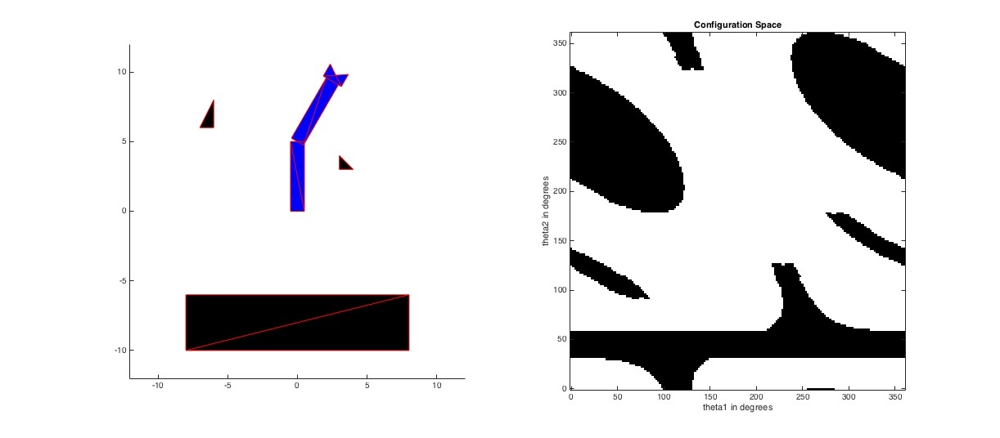
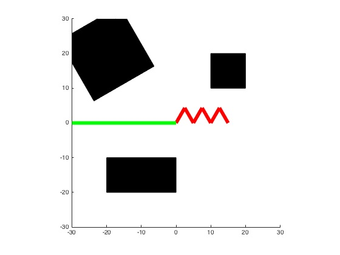

# Robotics---Computational-Motion-Planning
## 1. Graph-based Path Planning: 
Implementing the planning systems that work on 2D grid-like environments. For both sections the input map will be specified as a 2D logical array where the false or zero entries correspond to free cells and the true or non-zero entries correspond to obstacle cells. The goal of these planning routines is to construct a route between the specified start and destination cells. 
Two algorithms are to be implemented:
###    1. Dijkstra planner.

###    2. A* planner.

# 2. Configuration Space:
Writinging a program to help guide the two-link robot arm shown in the the figure below from one configuration to another while avoiding the objects in the workspace.

# 3. Probabilistic Roadmap:
writing a program to help guide the six-link robot shown in the figure below from one one configuration to another while avoiding the objects in the workspace with planning methods based on random sampling. The robot shown in the figure is comprised of six revolute links and its configuration can be specified with a vector (theta1; theta2; theta3; theta4; theta5; theta6) where each entry is an angle in degrees between 0 and 360. Function SixLinkRobot computes the layout of all of the links as a function of
the 6 parameters.

