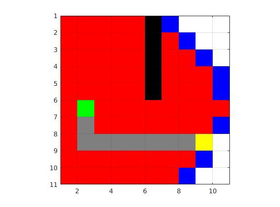
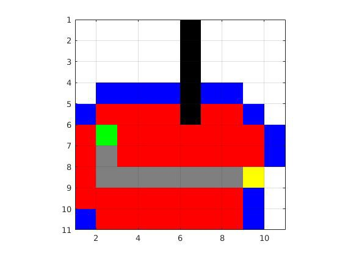
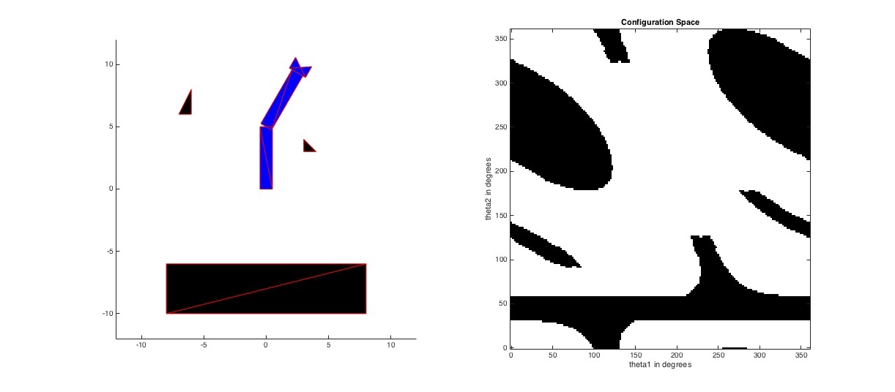

# Robotics---Computational-Motion-Planning
## 1. Graph-based Path Planning: 
Implementing the planning systems that work on 2D grid like environments. For both sections the input map will be specified as a 2D logical array where the false or zero entries correspond to free cells and the true or non-zero entries correspond to obstacle cells. The goal of these planning routines is to construct a route between the specified start and destination cells. 
Two algorithms are to be implemented:
    1. Dijkstra planner.
    
    2. A* planner.
    

## 2. Configuration Space:
writinging a program to help guide the two link robot arm shown in the the figure below from one configuration to another while avoiding the objects in the workspace.
    
    Format: 
